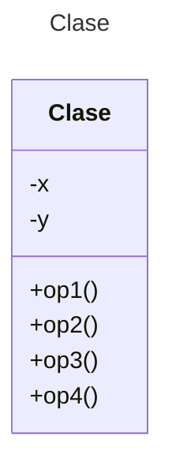

# Proyecto (Maven) - Figuras

Diseña un sistema para manejar figuras geométricas: círculos, elipses, rectángulos y cuadrados. Usa el patrón de diseño **Factory Method** acorde a los requisitos de diseño siguientes:

* Se tendrá una interface **Figura** para calcular el área y el perímetro de cada figura geométrica.
* Crea clases para manejar cada figura geométrica. Revisa el código que se te ofrece, en especial el uso de la herencia.
* Crea clases para manejar los cálculos geométricos de cada figura. Estas clases se implementarán basadas en **Factory Method**.
* Prueba el funcionamiento de tu programa con las pruebas unitarias que se te incluyen.

** Toma en cuenta los siguientes conceptos geométricos:

La elipse se puede considerar que es una especialización del círculo:

* Recuerda el [área y el perímetro de un círculo](https://www.geogebra.org/m/zvdrbpwr).
* Recuerda el [área y el perímetro de una elipse](https://www.geogebra.org/m/wekZJJG4).

* Recuerda el [área y el perímetro de un cuadrado](https://www.geogebra.org/m/JujCAg6D).
* Recuerda el [área y el perímetro de un rectangulo](https://www.geogebra.org/m/v3v8CeDM).

## Diagrama de clases
[Editor en línea](https://mermaid.live/)

[Referencia-Mermaid](https://mermaid.js.org/syntax/classDiagram.html)

## Diagrama de clases UML con draw.io
El repositorio está configurado para crear Diagramas de clases UML con ```draw.io```. Para usarlo simplemente das doble clic en el archivo  ```uml.class.drawio.png``` y se activará el editor ```draw.io``` integrado en ```VSCode``` para edición. Asegúrate de agregar las formas UML en el menú de formas del lado izquierdo (opción ```+Más formas```). Al final insertas el archivo ```uml.class.drawio.png``` en apartado de UML de este archivo README.
## Prompt para generar el Diagrama de Clases con IA - mermAID
```
@mermaid /uml
```
## Versión de Java

Verifica que tengas la versión adecuada de Java para trabajar con Maven. En caso de requerir una versión especial, usa los siguientes comandos.

### Verificar versión actual
```
java --version
```
### Verificar versiones disponibles para instalar
```
sdk list java
```
### Instalar la última versión
```
sdk install java
```
### Instalar una versión específica
```
sdk install java xxx-version
```
Ejemplo:
```
sdk install java 17.0.18-ms
```
## Uso del proyecto con Maven

### Compilar
```
mvn compile
```
### Probar N tests
```
mvn test
```
### Probar 1 test
```
mvn test -Dtest="AppTest#testCircle"
mvn test -Dtest="AppTest#testElipse"
mvn test -Dtest="AppTest#testCuadrado"
mvn test -Dtest="AppTest#testRectangulo"
```
### Ejecutar App
```
java -cp target/classes miPrincipal.App
```
### Ejecutar App con Maven
```
mvn exec:java
```
### Empacar App
```
mvn package
```
### Limpiar binarios
```
mvn clean
```
## Comandos Git-Cambios y envío a Autograding

### Por cada cambio importante que haga, actualice su historia usando los comandos:
```
git add .
git commit -m "Descripción del cambio"
```
### Envíe sus actualizaciones a GitHub para Autograding con el comando:
```
git push origin main
```
