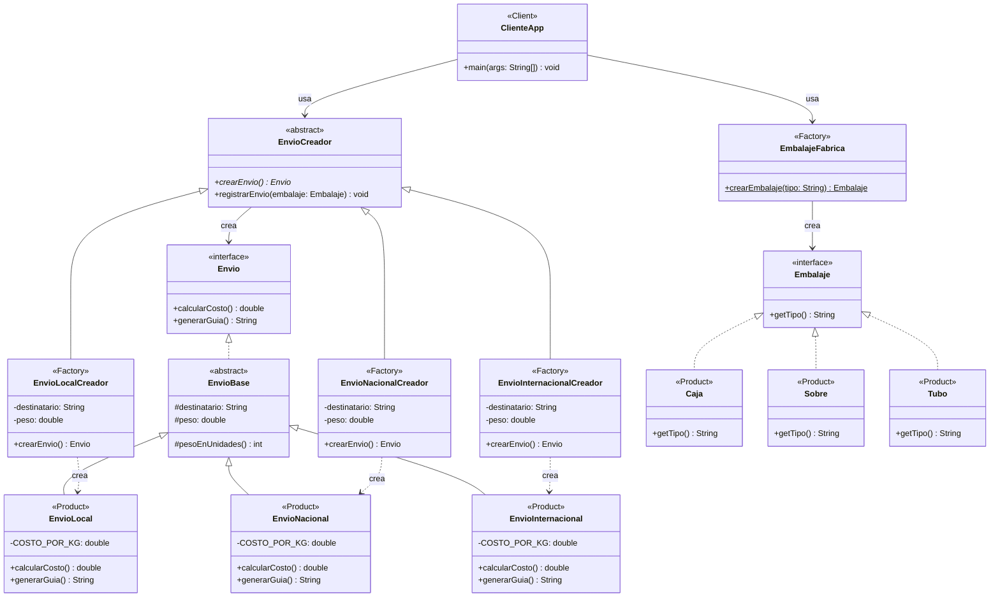

# Ejercicio: Gestor de Envíos - Patrón Factory

<p align="center">
  
</p>

## Dominio
Logística y paquetería

## Descripción breve
El sistema calcula y genera guías para distintos tipos de envío: local, nacional e internacional. Cada tipo de envío tiene reglas de costo y formato de guía distintos.

## Requisitos del ejercicio

- El programa se ejecuta en consola.
- Existe un producto abstracto `Envio` (interface) con las operaciones `calcularCosto()` y `generarGuia()`.
- Se utiliza **Factory Method** para delegar en creadores concretos la construcción del tipo de envío:
  - `EnvioLocalCreador`, `EnvioNacionalCreador`, `EnvioInternacionalCreador`.
- Se utiliza **Simple Factory** (`EmbalajeFabrica`) para crear el tipo de embalaje:
  - `Caja`, `Sobre`, `Tubo`.
- El `main` (ClienteApp) solo interactúa con las abstracciones `EnvioCreador` y `Embalaje`.

## Patrones de diseño utilizados

| Patrón | Clases involucradas |
|---|---|
| Factory Method | `EnvioCreador`, `EnvioLocalCreador`, `EnvioNacionalCreador`, `EnvioInternacionalCreador` |
| Simple Factory | `EmbalajeFabrica`, `Caja`, `Sobre`, `Tubo` |

## Escenario de ejecución en consola

```
--- Escenario 1: Envio Local con Sobre ---
=== Registrando Envío ===
Guía:     GUIA-LOCAL-JUANPEREZ-50
Costo:    $7.50
Embalaje: Sobre
========================

--- Escenario 2: Envio Nacional con Caja ---
=== Registrando Envío ===
Guía:     GUIA-NAC-MARIAGARCIA-200
Costo:    $90.00
Embalaje: Caja
========================

--- Escenario 3: Envio Internacional con Tubo ---
=== Registrando Envío ===
Guía:     GUIA-INTL-CARLOSRUIZ-120
Costo:    $144.00
Embalaje: Tubo
========================
```
## Diagrama de clases
[Editor en línea](https://mermaid.live/)

```mermaid
classDiagram
direction TB

class ClienteApp {
  <<Client>>
  +main(args: String[]) void
}

class EnvioCreador {
  <<abstract>>
  <<Factory>>
  +crearEnvio()* Envio
  +registrarEnvio(embalaje: Embalaje) void
}

class EnvioLocalCreador {
  <<Factory>>
  -destinatario: String
  -peso: double
  +crearEnvio() Envio
}

class EnvioNacionalCreador {
  <<Factory>>
  -destinatario: String
  -peso: double
  +crearEnvio() Envio
}

class EnvioInternacionalCreador {
  <<Factory>>
  -destinatario: String
  -peso: double
  +crearEnvio() Envio
}

class Envio {
  <<interface>>
  <<Product>>
  +calcularCosto() double
  +generarGuia() String
}

class EnvioBase {
  <<abstract>>
  <<Product>>
  #destinatario: String
  #peso: double
  #pesoEnUnidades() int
}

class EnvioLocal {
  <<Product>>
  -COSTO_POR_KG: double
  +calcularCosto() double
  +generarGuia() String
}

class EnvioNacional {
  <<Product>>
  -COSTO_POR_KG: double
  +calcularCosto() double
  +generarGuia() String
}

class EnvioInternacional {
  <<Product>>
  -COSTO_POR_KG: double
  +calcularCosto() double
  +generarGuia() String
}

class Embalaje {
  <<interface>>
  <<Product>>
  +getTipo() String
}

class Caja {
  <<Product>>
  +getTipo() String
}

class Sobre {
  <<Product>>
  +getTipo() String
}

class Tubo {
  <<Product>>
  +getTipo() String
}

class EmbalajeFabrica {
  <<Factory>>
  +crearEmbalaje(tipo: String)$ Embalaje
}

ClienteApp --> EnvioCreador : usa
ClienteApp --> EmbalajeFabrica : usa
EnvioCreador <|-- EnvioLocalCreador
EnvioCreador <|-- EnvioNacionalCreador
EnvioCreador <|-- EnvioInternacionalCreador
EnvioCreador --> Envio : crea
EnvioBase <|-- EnvioLocal
EnvioBase <|-- EnvioNacional
EnvioBase <|-- EnvioInternacional
Envio <|.. EnvioBase
EnvioLocalCreador ..> EnvioLocal : crea
EnvioNacionalCreador ..> EnvioNacional : crea
EnvioInternacionalCreador ..> EnvioInternacional : crea
EmbalajeFabrica --> Embalaje : crea
Embalaje <|.. Caja
Embalaje <|.. Sobre
Embalaje <|.. Tubo
```
[Referencia-Mermaid](https://mermaid.js.org/syntax/classDiagram.html)

## Diagrama de clases UML con draw.io

El repositorio está configurado para crear Diagramas de clases UML con ```draw.io```. Sigue estos pasos para usarlo:

1. Haz doble clic sobre el archivo ```uml.class.drawio.png``` en el explorador de archivos.
2. Se abrirá el editor de ```draw.io``` integrado en el entorno.
3. En la barra lateral izquierda, haz clic en ```+Más formas```.
4. En el cuadro de diálogo, busca y activa la categoría **UML** y haz clic en ```Aceptar```.
5. Las formas UML estarán disponibles en el panel izquierdo para arrastrarlas al lienzo.
6. Diseña tu diagrama de clases UML agregando clases, atributos, métodos y relaciones.
7. Guarda los cambios con ```Ctrl+S``` (o ```Cmd+S``` en Mac). El archivo ```.png``` se actualizará automáticamente.

### Prompts para generar los Diagramas de Clase y Secuencia con MermAId

Para mejores resultados sigue estos pasos:

1. Abre el chat de GitHub Copilot en tu entorno de desarrollo.
2. Agrega como contexto las clases del proyecto (por ejemplo, arrastra los archivos `.java` al chat o menciónalos con `#`).
3. Aplica el prompt para el **Diagrama de Clases UML**:

```
@mermaid /uml
```

4. Revisa el diagrama generado en la vista previa de Mermaid.
5. Si también necesitas un **Diagrama de Secuencia**, aplica el siguiente prompt (manteniendo el mismo contexto):

```
@mermaid /sequence
```

6. Copia el código Mermaid generado y pégalo en la sección correspondiente del ```README.md``` o en [el editor en línea](https://mermaid.live/) para visualizarlo.

## Versión de Java

Verifica que tengas la versión adecuada de Java para trabajar con Maven. En caso de requerir una versión especial, usa los siguientes comandos.

### Verificar versión actual
```
java --version
```
### Verificar versiones disponibles para instalar
```
sdk list java
```
### Instalar la última versión
```
sdk install java
```
### Instalar una versión específica
```
sdk install java xxx-version
```
Ejemplo:
```
sdk install java 17.0.18-ms
```
## Uso del proyecto con Maven

### Compilar
```
mvn compile
```
### Probar N tests
```
mvn test
```
### Probar 1 test
```
mvn test -Dtest="AppTest#testEnvioLocalCalcularCosto"
mvn test -Dtest="AppTest#testEnvioNacionalCalcularCosto"
mvn test -Dtest="AppTest#testEnvioInternacionalCalcularCosto"
mvn test -Dtest="AppTest#testEnvioLocalGenerarGuia"
mvn test -Dtest="AppTest#testEnvioNacionalGenerarGuia"
mvn test -Dtest="AppTest#testEnvioInternacionalGenerarGuia"
mvn test -Dtest="AppTest#testEmbalajeFabricaCrea_Caja"
mvn test -Dtest="AppTest#testEmbalajeFabricaCrea_Sobre"
mvn test -Dtest="AppTest#testEmbalajeFabricaCrea_Tubo"
mvn test -Dtest="AppTest#testEnvioLocalCreador_CreaEnvioLocal"
mvn test -Dtest="AppTest#testEnvioNacionalCreador_CreaEnvioNacional"
mvn test -Dtest="AppTest#testEnvioInternacionalCreador_CreaEnvioInternacional"
```
### Ejecutar App
```
mvn -q exec:java
```
```
java -cp target/classes miPrincipal.App
```
### Empacar App
```
mvn package
```
### Limpiar binarios
```
mvn clean
```
## Comandos Git-Cambios y envío a Autograding

### Por cada cambio importante que haga, actualice su historia usando los comandos:
```
git add .
git commit -m "Descripción del cambio"
```
### Envíe sus actualizaciones a GitHub para Autograding con el comando:
```
git push origin main
```
